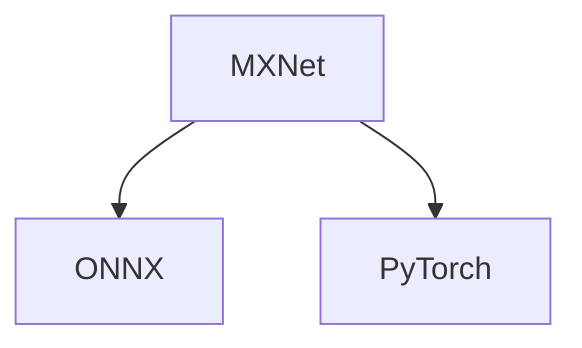

Project for conversion **MXNet** ResNet to **ONNX** and **PyTorch** frameworks.




| Models     | ONNX    | PyTorch |
|------------|---------|---------|
| ResNet-18  | &check; | &check; |
| ResNet-34  | &check; | &check; |
| ResNet-50  | &check; | &check; |
| ResNet-101 | &check; | &check; |
| ResNet-152 | &check; | &check; |

# Requirements

python 3.6 \
mxnet 1.6 \
onnx 1.6 \
onnxruntime 1.6 \
prettytable 2.5 \
pillow 8.4


# Environment

1. Create **_venv_** and install packages

```console
pip install --upgrade pip
pip install -r requirements.txt
```

3. Download ResNet-_***_ model

```console
wget http://data.mxnet.io/models/imagenet/resnet/***-layers/resnet-***-0000.params
wget http://data.mxnet.io/models/imagenet/resnet/***-layers/resnet-***-symbol.json
```

where _***_ is **18**, **34**, **50**, **101** or **152**.<br/><br/>

4. Put **MXNet model** in _model_mxnet/_

## Conversion MXNet to ONNX
1. Patch mxnet package (to resolve conversion problems) via

```console
patch -u venv/lib/python3.6/site-packages/mxnet/contrib/onnx/mx2onnx/_op_translations.py -i patch_files/mx2onnx/_op_translations.patch
patch -u venv/lib/python3.6/site-packages/mxnet/contrib/onnx/onnx2mx/_op_translations.py -i patch_files/onnx2mx/_op_translations.patch
```


2. Set parameters for running inferences via command line or in **_config.py_** as default values.

```console
python3 mxnet2onnx.py --prefix model_mxnet/model --onnx_model model_onnx/converted_model.onnx --input_shape 1,3,112,112 --conversion_log result/mxnet2onnx_log.txt
```

### Inference

#### MXNet

```console
python3 mxnet_inference.py --prefix model_mxnet/model --epoch 0 --input_image photo.bmp --input_shape 112,112 --mxnet_model_output  result/mxnet_inference.npy
```

#### ONNX (MXNet back)

```console
python3 onnx_inference_mxnet_back.py --onnx_model model_onnx/converted_model.onnx --input_image photo.bmp --input_shape 112,112 --onnx_mx_model_output  result/onnx_mxnet_inference.npy
```

#### ONNX Runtime

```console
python3 onnxruntime_inference.py --onnx_model model_onnx/converted_model.onnx --input_image photo.bmp --input_shape 112,112 --onnxruntime_model_output  result/onnxruntime_inference.npy 
```

### Embeddings comparison

```console
python3 outputs_comparison/test_mxnet_onnx_outputs.py --test_mx_onnx outputs_comparison/mxnet_onnx_test.txt
```


| MAX Errors to original <br/>MXNet model output | ResNet-18 ONNX (MXNet back) | ResNet-18 ONNX Runtime | ResNet-34  ONNX (MXNet back) | ResNet-34 ONNX Runtime | ResNet-50 ONNX (MXNet back) | ResNet-50 ONNX Runtime | ResNet-101 ONNX (MXNet back) | ResNet-101 ONNX Runtime | ResNet-152 ONNX (MXNet back) | ResNet-152 ONNX Runtime |
|------------------------------------------------|-----------------------------|------------------------|------------------------------|------------------------|-----------------------------|------------------------|------------------------------|-------------------------|------------------------------|-------------------------|
| Max Absolute error                             | 3.1292439e-07               | 3.427267e-07           | 7.1525574e-07                | 2.2053719e-06          | 2.4560359e-06               | 2.4571855e-06          | 3.017485e-07                 | 1.3113022e-06           | 5.9604645e-07                | 8.34465e-07             |
| Max Relative error                             | 5.1167663e-06               | 8.104576e-06           | 7.5552675e-06                | 1.1943803e-05          | 0.09271766                  | 0.092712365            | 6.6753587e-06                | 1.8716055e-05           | 6.8306026e-06                | 1.591998e-05            |


### Conversion problems

* _**ValidationError:** Unrecognized attribute: spatial for operator BatchNormalization._
* _**BroadcastIterator:**:Init(int64_t, int64_t) axis == 1 || axis == largest was false. Attempting to broadcast an axis
  by a dimension other than 1. 64 by 112_

Resolved by patching [Environment](#Environment) par. 2. \
More on

* https://github.com/apache/incubator-mxnet/pull/18846/files
* https://github.com/apache/incubator-mxnet/commit/f1a6df82a40d1d9e8be6f7c3f9f4dcfe75948bd6


## Conversion MXNet to PyTorch
Set parameters for running inferences via command line.
```console
python3 -m mmdnn.conversion._script.convertToIR -f mxnet -n model_mxnet/model-symbol.json -w model_mxnet/model-0000.params -d pytorch_IR/model_IR/model_IR --inputShape 3,112,112
python3 -m mmdnn.conversion._script.IRToCode -f pytorch --IRModelPath pytorch_IR/model_IR/model_IR.pb --dstModelPath pytorch_IR/kit_model/kit_model.py --IRWeightPath pytorch_IR/model_IR/model_IR.npy -dw pytorch_IR/kit_model/kit_model.npy
python3 -m mmdnn.conversion.examples.pytorch.imagenet_test --dump model_pytorch/model.pth -n pytorch_IR/kit_model/kit_model.py -w pytorch_IR/kit_model/kit_model.npy
cp pytorch_IR/kit_model/kit_model.py model_pytorch/kit_model.py
```

##### Warnings
**Warning**: MXNet Parser has not supported operator null with name data. \
**Warning**: convert the null operator with name [data] into input layer. \
**Warning**: SoftmaxOutput attrs are not supported in IR.

### Inference

Inference MXNet is same as [MXNet](###MXNet).

#### PyTorch
```console
python3 pytorch_inference.py --pytorch_model model_pytorch/model.pth --kit_model model_pytorch/kit_model.py --input_image photo.bmp --input_shape 112,112 --pytorch_model_output  result/pytorch_inference.npy
```

### Embeddings comparison
```console
python3 outputs_comparison/test_mxnet_pytorch_outputs.py --test_mx_pytorch outputs_comparison/mxnet_pytorch_test.txt
```


| MAX Errors PyTorch modelto original <br/>MXNet model output | Max Absolute error | Max Relative error |
|-------------------------------------------------------------|--------------------|--------------------|
| ResNet-18                                                   | 2.30968e-07        | 1.1440713e-05      |
| ResNet-34                                                   | 1.7881393e-06      | 1.8272698e-05      |
| ResNet-50                                                   | 8.34465e-07        | 2.2009388e-05      |
| ResNet-101                                                  | 4.172325e-07       | 1.54404e-05        |
| ResNet-152                                                  | 6.556511e-07       | 1.5342264e-05      |


